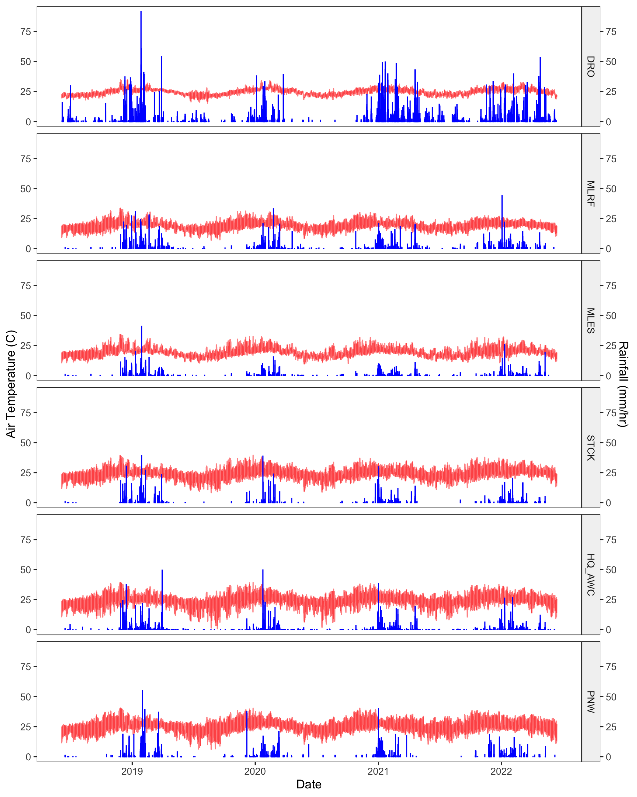

# WTF-Climate
This repository contains the code for constructing a 4-year climate dataset for the WTF project. Time series were constructed for 6 field sites in Queensland, Australia at 1 hour resolution.

| Site | Abbreviation | Coordinates | Type |
| --- | --- | --- | --- |
| Daintree Rainforest Observatory | DRO | -16.1012°N, 145.4478°E | low elevation rainforest
| Mt. Lewis Rainforest | MLRF | -16.5927°N, 145.2754°E | high elevation rainforest
| Mt. Lewis Sclerophyll | MLES | -16.58312°N, 145.2615°E | sclerophyll
| Station Creek | STCK | -16.61158°N, 145.2406°E | wet savanna
| AWC Brooklyn Sancutary Headquarters | HQ_AWC | -16.5831°N, 145.1860°E | dry savanna
| Pennyweight Outstation | PNW | -16.57427°N, 144.9158°E | dry savanna

## Data Usage
This dataset is available under the MIT license. 

The wthr_1hr_final.csv file contains the final dataset and the wthr_1hr_final_metadata.xlsx file contains information on variable descriptions and completeness.

## Data Preview

*Fig 1. Four-year time series of air temperature (red) and rainfall (blue) at all sites.*

## Scripts
To be executed in order:
1. process_dro_data.R : Reads in files from DRO and reformats for joining.
2. process_weather_station_data.R : Downloads and reads WTF weather station and ibutton data, then cleans and combines it with DRO data.
3. process_gap_filling_data.R : Downloads data from NASA, CHRS, and SILO for gap-filling.
4. gap_fill_weather.R : Gap-fills WTF station data to generate the final dataset.
5. plot_weather.R : Plots weather data for quality assessment.

## Methods
### In-situ weather
We aimed to construct a time series of typical weather variables across our 4-year field experiment (June 2018-2022). For that purpose, Vaisala Weather Transmitters (WXT530) were set up at PNW, STCK, MLES, and MLRF in September 2018 at 1.5 m above ground. Weather variables were recorded at a 10-minute resolution from September 2018 to June 2022. We obtained DRO weather from a weather stations located on a crane 50 m above the forest floor and managed by the DRO research station. We combined data from two stations: a long-term station that operated at a 30-minute resolution from January 2018 to March 2022 (Vaisala WXT520), and a newer station that operated at 1-minute resolution from November 2020 onwards (Vaisala HMP60). Soil and fuel conditions were also measured at 30-minute resolution at each site (Campbell CS655, CS506, 10 h Fuel Moisture Stick). Fuel sticks were placed in mesh bags directly on the ground.

Additionally, five ibuttons (Thermochron DS1920 Maxim Integrated) were placed at each site to measure the air temperature of the microclimate around the decomposing pine blocks. Ibuttons were placed 0.25 m from the ground and in PVC piping for shade1. The temperature was recorded at a 10-minute resolution from September 2018 to September 2019 and averaged across plots per site. A linear relationship was developed between Vaisala and ibutton air temperature to extend ibutton data across the experiment (R2 = 0.92).

### Post-processing and gap-filling
Weather data was cleaned with a combination of data visualization and seasonal-trend anomaly detection using the package "anomalize" and solar angles were calculated with the "solarPos" package in R (version 4.0.4)2,3. The data was further harmonized into a 1-hour resolution dataset. 

Only the STCK and MLES weather stations obtained relatively complete datasets during our study period. Therefore, we used the gridded product PERSIANN-Cloud Classification System (PERSIANN-CCS) from the Center for Hydrometeorology and Remote Sensing (CHRS, https://chrsdata.eng.uci.edu)4 to gap-fill precipitation data and the National Aeronautics and Space Administration's Prediction of Worldwide Energy Resources (NASA POWER, https://power.larc.nasa.gov)5 database for the remaining variables and the solar radiation related variables including total solar shortwave and longwave radiation, solar azimuth and solar elevation angle (Table S2). Both databases had data available at a 1-hour resolution. In addition, NASA POWER had a spatial resolution of 0.5° x 0.625° for meteorology and 1° x 1° for solar parameters, while CHRS had a 0.04° x 0.04° resolution, allowing us to get the missing data from locations close to our study sites.

### Quality Assessment
We expected to observe the following rainfall gradient (highest to lowest): DRO > MLRF > MLES > STCK > HQ_AWC > PNW. However, the average annual precipitation from highest to lowest in our dataset was: DRO (3319 mm/yr), MLRF (771 mm/yr), PNW (687 mm/yr), HQ_AWC (653 mm/yr), STCK (509 mm/yr), and MLES (401 mm/yr). High rainfall at PNW may have been due to gap-filling and low rainfall at MLES may have been due to canopy cover preventing our in-situ sensors from detecting rainfall. To assess the quality of our dataset, we compared our dataset to rainfall data from SILO Long Paddock, an Australia climate database that offers 0.05° x 0.05° gridded data at daily temporal resolution (SILO, https://www.longpaddock.qld.gov.au/silo/)6.

*Fig 2. Monthly rainfall comparison between SILO (gray, dashed) and WTF-Climate (blue, solid) datasets. WTF-Climate points colored purple indicate months in which the majority of data was gap-filled using CHRS. Gap-filled data results in slight deviations from expected rainfall. Despite these descrepencies, the seasonal trend is consistent with that of the SILO database.*

### Citations
1. Fallon, Beth, and Jeannine Cavender-Bares. “Leaf-Level Trade-Offs between Drought Avoidance and Desiccation Recovery Drive Elevation Stratification in Arid Oaks.” Ecosphere 9, no. 3 (2018): e02149. https://doi.org/10.1002/ecs2.2149.
2. Matt Dancho and Davis Vaughan (2020). anomalize: Tidy Anomaly Detection. R package version 0.2.2. https://CRAN.R-project.org/package=anomalize.
3. Jasper Van doninck (2016). solarPos: Solar Position Algorithm for Solar Radiation Applications. R package version 1.0. https://CRAN.R-project.org/package=solarPos
4. Nguyen, Phu, Eric J. Shearer, Hoang Tran, Mohammed Ombadi, Negin Hayatbini, Thanh Palacios, Phat Huynh, et al. “The CHRS Data Portal, an Easily Accessible Public Repository for PERSIANN Global Satellite Precipitation Data.” Scientific Data 6, no. 1 (January 8, 2019): 180296. https://doi.org/10.1038/sdata.2018.296.
5. The data was obtained from the National Aeronautics and Space Administration (NASA) Langley Research Center (LaRC) Prediction of Worldwide Energy Resource (POWER) Project funded through the NASA Earth Science/Applied Science Program. The data was obtained from the POWER Project's Hourly 2.2.9 version on 2023/04/03.
6. Jeffrey, Stephen J., John O. Carter, Keith B. Moodie, and Alan R. Beswick. “Using Spatial Interpolation to Construct a Comprehensive Archive of Australian Climate Data.” Environmental Modelling & Software 16, no. 4 (June 1, 2001): 309–30. https://doi.org/10.1016/S1364-8152(01)00008-1.

